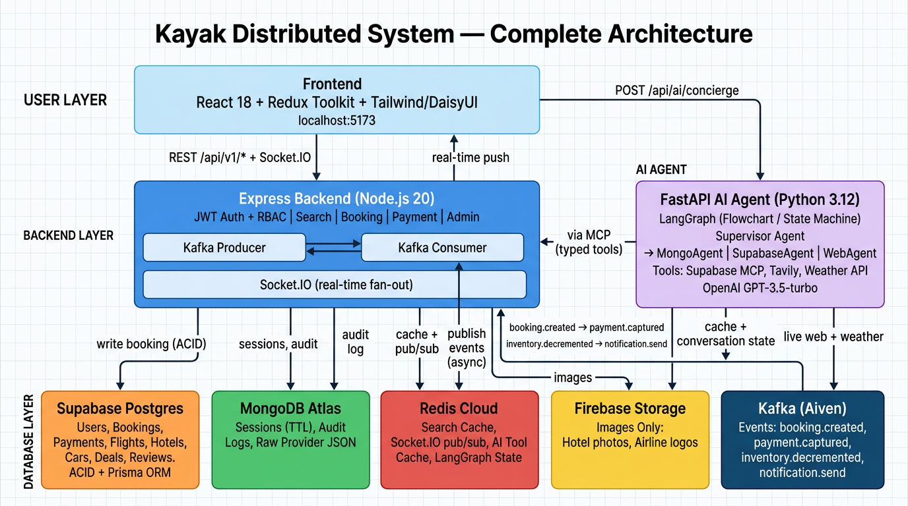
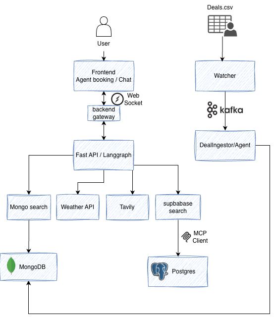

# Kayak Distributed System

A cloud-native travel booking platform (flights, hotels, cars, payments) built as a **microservice + event-driven** system with a multi-agent AI concierge.

---

## Architecture



### Three Services

| Service | Tech | Role |
|---------|------|------|
| **Backend** | Node.js 20, Express | REST API, Kafka producer/consumer, Socket.IO, JWT+RBAC |
| **Frontend** | React 18, Vite, Redux Toolkit | UI, search, booking flow, AI chat |
| **AI Agent** | Python 3.12, FastAPI | LangGraph multi-agent concierge |

### Five Data Stores

| Store | Used For |
|-------|---------|
| **Supabase Postgres** | Users, bookings, payments, flights, hotels, cars, deals, reviews. ACID + Prisma ORM. Also queried by AI agent via Supabase MCP. |
| **MongoDB Atlas** | Sessions (TTL auto-expiry), audit logs, raw provider JSON (flexible schema). |
| **Redis Cloud** | Search cache, Socket.IO pub/sub (multi-pod), AI tool cache, LangGraph conversation state. |
| **Firebase Storage** | Hotel photos, airline logos. CDN-backed blob store. Images only. |
| **Kafka (Aiven)** | Async event bus: `booking.created`, `payment.captured`, `inventory.decremented`, `notification.send`. |

---

## AI Concierge — How It Works



The AI agent uses **LangChain + LangGraph** in a multi-agent setup.

### What is LangChain
LangChain is an open source orchestration framework that gives GPT **hands** — the ability to call real tools (your DB, web search, weather API) instead of guessing. It runs the **ReAct loop** automatically: GPT thinks → calls a tool → reads result → thinks again → answers.

### What is LangGraph
LangGraph is built on top of LangChain. It defines the AI system as a **flowchart** — nodes (steps) + edges (routing) + state (shared data). Instead of one agent with all tools, it routes to the right specialist.

### Multi-Agent Architecture

```
User: "Show my last booking and weather in NYC"
              ↓
    LangGraph Supervisor Agent
    reads message, decides routing
              ↓
    ┌─────────────────────────┐
    ▼                         ▼
SupabaseAgent            WebAgent
(bookings, deals,        (Tavily web search,
 payments via MCP)        Weather API)
    ↓                         ↓
get_my_bookings(42)      get_weather("NYC")
→ Delta NYC $189          → 45°F cloudy
    ↓                         ↓
    └──────────┬──────────────┘
               ↓
    GPT composes final answer:
    "Last booking: Delta NYC $189 on Jan 5.
     NYC tomorrow: 45°F, cloudy — pack a jacket!"
               ↓
    Streamed to user via SSE
    State saved to Redis (conversation memory)
```

### Three Specialist Agents

| Agent | Has Access To | Handles |
|-------|-------------|---------|
| **MongoAgent** | MongoDB Atlas | User profiles, sessions, account data |
| **SupabaseAgent** | Supabase Postgres via MCP | Bookings, payments, flight/hotel deals |
| **WebAgent** | Tavily + Weather API | General travel info, live web, real-time weather |

### Why Supabase MCP Instead of Raw SQL
MCP exposes the database as **typed, named functions** — `get_my_bookings(user_id)`, `search_deals(city, date)`. GPT calls functions, not SQL. `DROP TABLE` doesn't exist as a function → GPT literally cannot do it. The `user_id` is always injected from JWT auth — never taken from the user's message.

---

## Kafka — Async Event Flow

**Rule:** User waiting on a response → synchronous REST. Side-effect that can happen seconds later → Kafka.

```
User books a flight
        ↓
write booking → Supabase Postgres   ← synchronous (user waits, 50ms)
publish booking.created → Kafka     ← 10ms, then user gets response ✅

Meanwhile in background:
  Consumer 1: booking.created   → charge payment → publish payment.captured
  Consumer 2: payment.captured  → send confirmation email
  Consumer 3: booking.created   → decrement seat inventory
  Consumer 4: inventory.updated → invalidate Redis cache, write MongoDB audit log
  Socket.IO                     → push real-time update to user's browser tab
```

Without Kafka: user waits ~1250ms (booking + payment + email + audit all inline).
With Kafka: user waits ~60ms. Everything else runs async.

---

## Quick Start

### Prerequisites

- Node.js 20+
- Docker & Docker Compose
- Python 3.12+ (for AI-agent)
- Cloud accounts: Supabase, MongoDB Atlas, Redis Cloud, Firebase, Aiven (Kafka)

### 1. Environment Setup

Copy the example files and fill in your own credentials:

```bash
cp backend/.env.example        backend/.env
cp frontend/.env.example       frontend/.env
cp ai-agent/.env.example       ai-agent/.env
```

Each `.env.example` file lists every required variable with a description. You will need accounts for:

| Service | Variable prefix | Get it from |
|---------|----------------|-------------|
| Supabase | `DATABASE_URL`, `SUPABASE_MCP_URL`, `SUPABASE_ACCESS_TOKEN` | [supabase.com](https://supabase.com) |
| MongoDB Atlas | `MONGODB_URI` | [mongodb.com/atlas](https://mongodb.com/atlas) |
| Redis Cloud | `REDIS_URL` | [redis.com/cloud](https://redis.com/cloud) |
| Firebase | `FIREBASE_SERVICE_ACCOUNT`, `FIREBASE_STORAGE_BUCKET` | [firebase.google.com](https://firebase.google.com) |
| OpenAI | `OPENAI_API_KEY` | [platform.openai.com](https://platform.openai.com) |
| Tavily | `TAVILY_API_KEY` | [tavily.com](https://tavily.com) |
| OpenWeatherMap | `WEATHER_API_KEY` | [openweathermap.org](https://openweathermap.org) |
| Aiven Kafka | `KAFKA_BROKER`, `KAFKA_USERNAME`, `KAFKA_PASSWORD` | [aiven.io](https://aiven.io) |

> **Never commit `.env` files.** They are in `.gitignore`. All secrets stay local or in your cloud provider's secret store.

### 2. Start with Docker

```bash
# Enable BuildKit for faster builds
export COMPOSE_DOCKER_CLI_BUILD=1
export DOCKER_BUILDKIT=1

# Build and start all services
docker-compose up --build -d

# View logs
docker-compose logs -f

# Stop services
docker-compose down
```

Services:
- Backend: `http://localhost:3000`
- Frontend: `http://localhost:5173`
- AI-Agent: `http://localhost:8000`

### 3. Seed Database (Optional)

```bash
cd backend
npm run seed:us-data    # Seeds flights, hotels, cars for US cities
npm run seed:test-users # Creates test users for E2E tests
```

### 4. Local Development

**Backend:**
```bash
cd backend
npm install
npm run dev  # http://localhost:3000
```

**Frontend:**
```bash
cd frontend
npm install
npm run dev  # http://localhost:5173
```

**AI-Agent:**
```bash
cd ai-agent
./update-requirements.sh  # Creates .venv and requirements.txt
source .venv/bin/activate
uvicorn main:app --reload  # http://localhost:8000
```

```powershell
# Windows
cd ai-agent
pwsh -ExecutionPolicy Bypass -File ./update-requirements.ps1
.\.venv\Scripts\Activate.ps1
uvicorn main:app --reload  # http://localhost:8000
```

---

## Tech Stack

| Layer | Tech |
|-------|------|
| Frontend | React 18, Vite, Redux Toolkit, Tailwind CSS + DaisyUI |
| Backend | Node.js 20, Express.js, Prisma ORM |
| AI Agent | Python 3.12, FastAPI, LangChain, LangGraph, OpenAI GPT |
| Databases | Supabase Postgres, MongoDB Atlas, Redis Cloud, Firebase Storage |
| Messaging | Kafka (Aiven), Socket.IO |
| Auth | JWT + RBAC |
| Testing | Jest (unit), Playwright (E2E), JMeter (load) |

---

## Features

- User authentication (JWT + RBAC — admin vs end-user)
- Flight, hotel, car search and booking
- Payment processing
- Admin inventory management
- Real-time booking confirmations via Socket.IO
- AI concierge (LangGraph multi-agent: Supabase MCP + Tavily web search + Weather API)
- Kafka event streaming (booking → payment → inventory → notification)
- Redis caching (toggle via `CACHE_ENABLED`)
- Firebase image storage

---

## API

All endpoints: `/api/v1/*`
See `api-docs/openapi.yaml` for full specification.

---

## Testing

```bash
cd e2e
npm install
npm test  # Runs Playwright E2E tests
```

Test users are auto-created via `globalSetup` in `playwright.config.js`.

---

## Documentation

- [Database Setup](./backend/docs/DATABASE_SETUP.md) — Cloud database configuration
- [Firebase Setup](./docs/FIREBASE_SETUP.md) — Image storage setup
- [Kafka Setup](./backend/kafka/README.md) — Event streaming
- [Sample Deals Feed](./docs/SAMPLE_DEALS_FEED.md) — Hourly rotating flight/hotel/car deals for the AI concierge
- [API Docs](./api-docs/README.md) — OpenAPI specification
- [Cloud Services Verification](./CLOUD_SERVICES_VERIFICATION.md) — Verifies all DBs are cloud-only (no localhost URIs)
